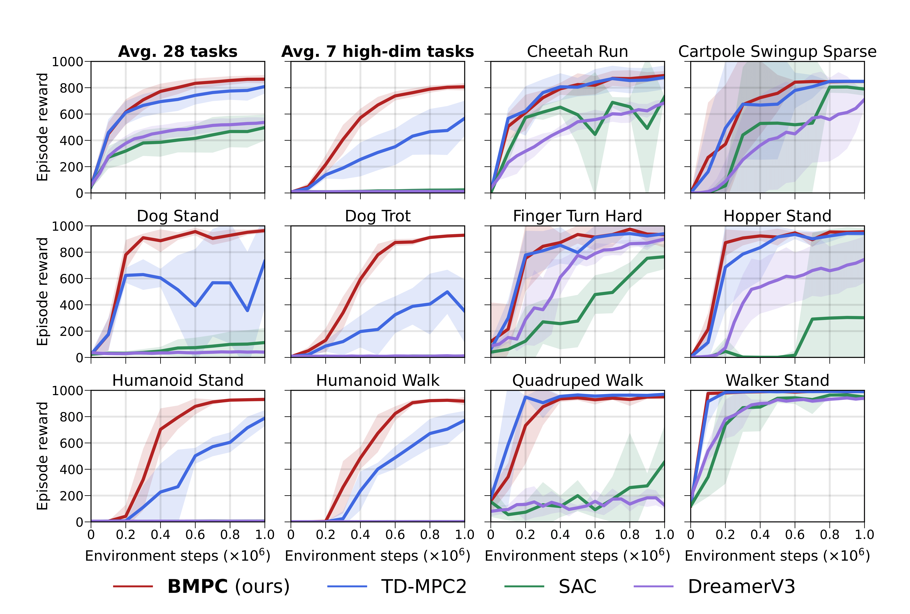

# Bootstrapped Model Predictive Control

Official implementation of [Bootstrapped Model Predictive Control](https://openreview.net/forum?id=i7jAYFYDcM&noteId=TJpOFyUgv7) by

Yuhang Wang, Hanwei Guo, Sizhe Wang, Long Qian, Xuguang Lan\*

## Overview

BMPC is a model-based reinforcement learning algorithm built on TD-MPC2’s world model, designed to enhance policy learning through expert iteration. BMPC leverages Model Predictive Control (MPC) to iteratively refine its network policy, leading to better value estimation and improved planning efficiency.


BMPC is evaluated on 42 continuous control tasks from DMControl and HumanoidBench, demonstrating superior sample efficiency and stability, particularly in challenging high-dimensional tasks.

## Installation

We use the `Dockerfile` from TD-MPC2. You can build the docker image by running

```
cd docker && docker build . -t <user>/bmpc:1.0.0
```

This docker image contains all dependencies needed for running DMControl, Meta-World, and ManiSkill2 experiments.

If you prefer to install dependencies manually, start by installing dependencies via `conda` by running the following command:

```
conda env create -f docker/environment.yaml
pip install gym==0.21.0
```

The `environment.yaml` file installs dependencies required for training on DMControl tasks. Other domains can be installed by following the instructions in `environment.yaml`.

Depending on your existing system packages, you may need to install other dependencies. See `docker/Dockerfile` for a list of recommended system packages.

## Training

See below examples on how to train a BMPC agent in the default setting. 

```
$ python train.py compile=true task=dog-run steps=1000000
```

If you prefer, you can also train a TD-MPC2 agent using the following command:

```
$ python train.py compile=true task=dog-run steps=1000000 bmpc=false num_q=5 log_std_min=-10 log_std_max=2 
```

See `config.yaml` for a full list of arguments.

## Supported tasks
This codebase currently supports continuous control tasks from **DMControl**, **Meta-World**, **ManiSkill2**, **MyoSuite** and **HumanoidBench**, which covers all tasks used in the paper. See below table for expected name formatting:

| domain | task
| --- | --- |
| dmcontrol | dog-run
| dmcontrol | cheetah-run-backwards
| metaworld | mw-assembly
| metaworld | mw-pick-place-wall
| maniskill | pick-cube
| maniskill | pick-ycb
| myosuite  | myo-key-turn
| myosuite  | myo-key-turn-hard
| humanoidbench | humanoid_h1-slide-v0
| humanoidbench | humanoid_h1hand-walk-v0

which can be run by specifying the `task` argument for `train.py`.

## Speedup

You can enable 4× speedup by setting flag `compile=true`. Before doing so, make sure your gcc version is ≥ 9, you can install gcc 11 using the following command:

```
conda install -c conda-forge gcc=11 gxx=11
```

## Citation

If you find this repo useful, please consider citing our paper as follows:

```
@inproceedings{wang2025bootstrapped,
  title={Bootstrapped Model Predictive Control},
  author={Yuhang Wang and Hanwei Guo and Sizhe Wang and Long Qian and Xuguang Lan},
  booktitle={The Thirteenth International Conference on Learning Representations},
  year={2025}
}
```

## Reference

The code is developed based on Nicklas Hansen's TD-MPC2 [implementation](https://github.com/nicklashansen/tdmpc2).

Shane Flandermeyer implemented a performant JAX version of BMPC. If you prefer using JAX, check [here](https://github.com/ShaneFlandermeyer/bmpc-jax).

